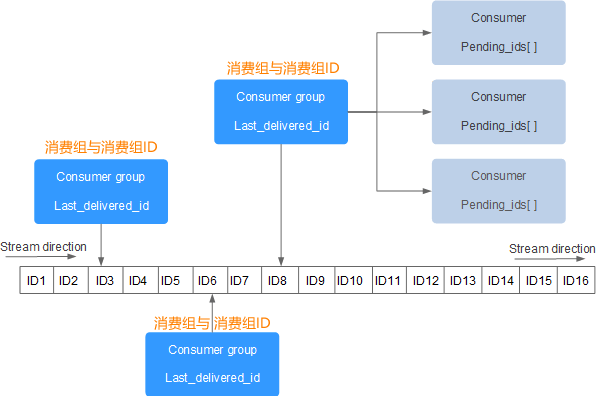

# redis stream

Redis 5.0 版本引入的一种新数据类型, Redis Stream 正是借鉴了 Kafaka 系统。

- 拥有很高的性能、良好的内存利用率
- 提供了消息的持久化存储，解决了网络断开、Redis 宕机情况下，消息丢失的问题，即便是重启 Redis，存储的内容也会存在
- 提供了主从复制功能

## 底层结构

Stream 消息队列主要由四部分组成，分别是：消息本身、生产者、消费者和消费组，

- Stream direction：表示数据流，它是一个消息链，将所有的消息都串起来，每个消息都有一个唯一标识 ID 和对应的消息内容（Message content）。
- Consumer Group ：表示消费组，拥有唯一的组名，使用 XGROUP CREATE 命令创建。一个 Stream 消息链上可以有多个消费组，一个消费组内拥有多个消费者，每一个消费者也有一个唯一的 ID 标识。
- last_delivered_id ：表示消费组游标，每个消费组都会有一个游标 last_delivered_id，任意一个消费者读取了消息都会使游标 last_delivered_id 往前移动。
- pending_ids ：Redis 官方称为 PEL，表示消费者的状态变量，它记录了当前已经被客户端读取的消息 ID，但是这些消息没有被 ACK(确认字符)。如果客户端没有 ACK，那么这个变量中的消息 ID
  会越来越多，一旦被某个消息被 ACK，它就开始减少。

## 流程

1. 消息生产者使用 `xadd` 追加消息(消息内容是hash结构的键值对);
2. 不定义消费组的情况下，使用`xread` 指令可以进行stream消息的独立消费;
3. 定义消费组的情况下，使用 `xgroup create` 指令创建消费组(需要提供传递初始消息ID来初始化);
4. 进行组内消费，使用 `xread group` 指令进行消费组的组内消费(需要提供消费组名称、消费者名称、起始消息ID)，同`xread`一样也可以阻塞等待新消息，读到消息后， 对应的消息ID就会进入消费者PEL结构里;
5. 客户端处理完毕后使用 `xack` 指令通知服务器， 本条消息已经处理完毕，该消息 ID 就会从 PEL 中移除。

> ACK（Acknowledge character）即确认字符，在数据通信中，接收方传递给发送方的一种传输类控制字符。表示发来的数据已确认接收无误。在 TCP/IP 协议中，如果接收方成功的接收到数据，那么会回复一个 ACK 数据。通常 ACK 信号有自己固定的格式，长度大小，由接收方回复给发送方。

## 问题
Q：stream消息太多了怎么办？

A：xadd指令提供了一个定长长度maxlen, 可以将老的消息丢弃，确保最多不超过指定长度。节省了内存空间。
`xadd mystream maxlen ~ 1000 * ... entry fields here ...`

Q: PEL 是如何避免消息丢失的?

A: 消费者在读取stream消息时，服务器将消息回复给消费者时，客户端如果断开连接，消息就丢失了。但是PEL里面已经保存了服务器已经发出去的消息ID，
待消费者重新连上服务器后，可以再次收到PEL中的消息ID列表。不过此时 `xreadgroup` 的起始消息ID不能是 参数`>`，而是任意有效的的消息ID。

