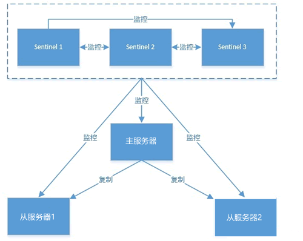

# redis client客户端

Redis 的底层是一个单线程模型，单线程指的是使用一个线程来处理所有的网络事件请求，这样就避免了多进程或者多线程切换导致的 CPU 消耗，而且也不用考虑各种锁的问题。

Redis 为了充分利用单线程，加快服务器的处理速度，它采用 IO 多路复用模型来处理客户端与服务端的连接，这种模型有三种实现方式，分别是 select、poll、epoll。Redis 正是采用 [epoll](https://segmentfault.com/a/1190000003063859) 的方式来监控多个 IO 事件。当客户端空闲时，线程处于阻塞状态；当一个或多个 IO 事件触发时（客户端发起网路连接请求），线程就会从阻塞状态唤醒，并同时使用epoll来轮询触发事件，并依次提交给线程处理。

# redis server服务端

Redis 服务器能够以高可用集群的方式对外提供服务。所谓高可用集群，指的是多台 Redis 服务器组成的服务器架构，每台服务器都提供相同的服务，从而让服务器达到一个稳定，高效的运行状态。

## 主从模式

Redis 主机会一直将自己的数据复制给 Redis 从机，从而实现主从同步。在这个过程中，只有 master 主机可执行写命令，其他 salve 从机只能只能执行读命令，这种读写分离的模式可以大大减轻 Redis 主机的数据读取压力，从而提高了Redis 的效率，并同时提供了多个数据备份。主从模式是搭建 Redis Cluster 集群最简单的一种方式。

主从模式下，数据的同步是自动完成的，这个数据同步的过程，又称为全量复制。

主从模式的不足：

- 不具备自动容错和恢复功能，如果主节点宕机，Redis 集群将无法工作，此时需要人为干预，将从节点提升为主节点;
- 如果主机宕机前有一部分数据未能及时同步到从机，即使切换主机后也会造成数据不一致的问题，从而降低了系统的可用性;
- 只有一个主节点，所以其写入能力和存储能力都受到一定程度地限制;
- 在进行数据全量同步时，若同步的数据量较大可能会造卡顿的现象;

主从模式的可用性较低，不适用于线上生产环境;

## 哨兵模式

一种特殊的模式，Redis 为其提供了专属的哨兵命令，它是一个独立的进程，能够独立运行。下面使用 Sentinel 搭建 Redis 集群的基本结构。

哨兵主要有两个重要作用：
- 第一：哨兵节点会以每秒一次的频率对每个 Redis 节点发送PING命令，并通过 Redis 节点的回复来判断其运行状态。
- 第二：当哨兵监测到主服务器发生故障时，会自动在从节点中选择一台将机器，并其提升为主服务器，然后使用 PubSub 发布订阅模式，通知其他的从节点，修改配置文件，跟随新的主服务器。

在实际生产情况中，Redis Sentinel 是集群的高可用的保障，为避免 Sentinel 发生意外，它一般是由 3～5 个节点组成，这样就算挂了个别节点，该集群仍然可以正常运转。

多哨兵模式下，哨兵之间存在相互监控。Sentinel 负责监控主从节点的“健康”状态。当主节点挂掉时，自动选择一个最优的从节点切换为主节点。客户端来连接 Redis 集群时，会首先连接 Sentinel，通过 Sentinel 来查询主节点的地址，然后再去连接主节点进行数据交互。当主节点发生故障时，客户端会重新向 Sentinel 要地址，Sentinel 会将最新的主节点地址告诉客户端。因此应用程序无需重启即可自动完成主从节点切换。

