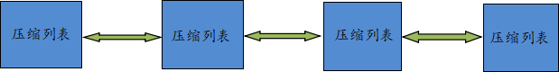

# redis list 列表

redis list列表类似 Java中的linkedList结构，一个链表而非数组，插入、删除元素时间复杂度O(1)，查询元素时间复杂度O(n)。

- 指定key, 然后可以通过命令从列表左侧或右侧添加元素，按添加时间顺序排列，一个列表最多包含 2^32 - 1 个元素
- 列表弹出最后一个元素时，结构会自动删除该元素

## 底层存储结构

redis list 列表底层存储结构，是一个快速列表 quicklist 结构。redis 采用 quicklist + ziplist 相结合的方式， 避免了单独使用链表存储空间的浪费情况。将多个 ziplist
使用双向指针串联起来，这样既能满足快速插入、删除的特性，又节省了一部分存储空间。

- 当列表中存储元素较少时，使用一块连续的内存来存储，这个连续结构称为 ziplist 压缩列表，它的所有元素紧挨在一起
- 当列表中存储元素较多时，使用quicklist 存储元素
  

## 应用场景
- 队列模型 `rpush lpop`
- 栈模型 `rpush rpop`
- 异步队列, 一个线程将需要延时处理的任务序列化成字符串，并“塞”进 Redis 列表中，而另外一个线程则以轮询的方式从该列表中读取“任务”。

