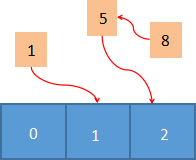
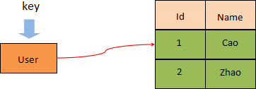

# redis hash 散列

redis hash 散列是由字符类型的 field（字段）和 value 组成的哈希映射表结构（也称散列表），它非常类似于表格结构。在 hash 类型中，field 与 value 一一对应，且不允许重复。

- 一个 hash 类型的 key 最多可以存储 2^32-1（约 40 亿个）字段/值。
- hash 会为这个 key 额外储存一些附加的管理信息，比如这个键的类型、最后一次访问这个键的时间等，所以 hash 键越来越多时，Redis 耗费在管理信息方面的内存就越多。
- 当 hash 类型移除最后一个元素后，该存储结构就会被自动删除，其占用内存也会被系统回收。

## 底层存储结构

- 当存储的数据量较少的时，hash 采用 ziplist 作为底层存储结构，此时要求符合以下两个条件：
    * 哈希对象保存的所有键值对（键和值）的字符串长度总和小于 64 个字节
    * 哈希对象保存的键值对数量要小于 512 个
- 当无法满足上述条件时，hash 采用 dict（字典结构），该结构类似于 Java 的 HashMap，是一个无序的字典，并采用了数组和链表相结合的方式存储数据。
    * dict是基于哈希表算法实现的，查询性能非常高，时间复杂度O(1)
    * redis采用链表地址法解决哈希冲突问题 

## 应用场景

- 存储对象, 一个 filed/value 可以看做是表格中一条数据记录。
- 