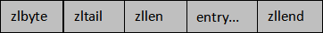

# redis zset 有序集合

- 集合中的每一个成员都是字符串类型，并且不允许重复;
- 每个集合成员都会关联一个 double（双精度浮点数）类型的 score (分数值)，通过 score 实现了对集合成员的排序;
- 集合成员是唯一存在的，但是分数（score）却可以重复;
- 有序集合的最大的成员数为 2^32 - 1

## 底层存储结构

有序集合（zset）同样使用了两种不同的存储结构，分别是 zipList（压缩列表）和 skipList（跳跃列表）

- 当 zset 满足以下条件时使用压缩列表：
    * 成员的数量小于128 个
    * 每个 member （成员）的字符串长度都小于 64 个字节
- 当有序结合不满足使用 ziplist 压缩列表的条件时，就会使用 skipList 跳跃列表结构来存储数据。

ziplist 结构说明



```text
上述每一部分在内存中都是紧密相邻的，并承担着不同的作用，介绍如下：
* zlbytes 是一个无符号整数，表示当前 ziplist 占用的总字节数；
* zltail 指的是压缩列表尾部元素相对于压缩列表起始元素的偏移量。
* zllen 指 ziplist 中 entry 的数量。当 zllen 比2^16 - 2大时，需要完全遍历 entry 列表来获取 entry 的总数目。
* entry 用来存放具体的数据项（score和member），长度不定，可以是字节数组或整数，entry 会根据成员的数量自动扩容。
* zlend 是一个单字节的特殊值，等于 255，起到标识 ziplist 内存结束点的作用。

当 zset 使用压缩列表保存数据时，entry 的第一个节点保存 member，第二个节点保存 score。
依次类推，集合中的所有成员最终会按照 score 从小到大排列。
```

skiplist 结构说明


一种基于链表实现的随机化数据结构，其插入、删除、查找的时间复杂度均为 O(logN)。 从名字可以看出“跳跃列表”，并不同于一般的普通链表，它的结构较为复杂。

```text
typedf struct zskiplist{
    //头节点
    struct zskiplistNode *header;
    //尾节点
    struct zskiplistNode *tail;
    // 跳表中的元素个数
    unsigned long length;
    //表内节点的最大层数
    int level;
}zskiplist;

* header：指向 skiplist 的头节点指针，通过它可以直接找到跳表的头节点，时间复杂度为 O(1)；
* tail：指向 skiplist 的尾节点指针，通过它可以直接找到跳表的尾节点，时间复杂度为 O(1)；
* length：记录 skiplist 的长度，也就跳表中有多少个元素，但不包括头节点；
* level：记录当前跳表内所有节点中的最大层数（level）；

```

跳跃列表的每一层都是一个有序的链表，链表中每个节点都包含两个指针，一个指向同一层的下了一个节点，另一个指向下一层的同一个节点。最低层的链表将包含 zset
中的所有元素。如果说一个元素出现在了某一层，那么低于该层的所有层都将包含这个元素，也就说高层是底层的子集。

在 Redis 中一个 skipList 节点最高可以达到 64 层，一个“跳表”中最多可以存储 2^64 个元素，每个节点都是一个 skiplistNode（跳表节点）。

## 应用场景

- 排行榜
- 热门榜单
